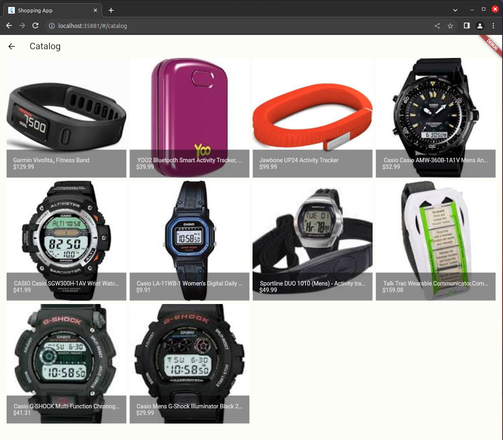

# Flutter Ecommerce

A simple ecommerce project for learninng Flutter

## Running the app

1. Install the dependencies with `flutter pub get`
2. Run the app with `flutter run`

## Features

**_View the app on mobile..._**

**_On desktop..._**

**_And on the web!_**

## Technologies Used

- Flutter
- Supabase

## Authors

👤 **Andrew Baldwin**

- Github: [@andrewbaldwin44](https://github.com/andrewbaldwin44)

